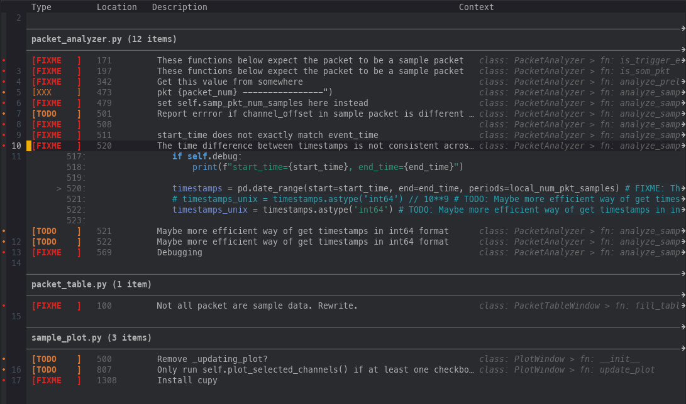

# emacs-todo-explorer

Project-wide TODO/FIXME/NOTE explorer for Emacs. Scans your project and displays results in a dedicated, interactive buffer with sorting, filtering, and source navigation.

Requires Emacs 28.1+. Zero external dependencies. Uses ripgrep when available, falls back to grep or native elisp.

## Features

- Async scanning via ripgrep, grep, or native elisp (auto-detected)
- Color-coded keyword badges with priority fringe indicators
- Semantic context column (enclosing function/scope) via tree-sitter or `add-log-current-defun`
- Syntax-highlighted expandable context lines around each item
- Follow mode (auto-peek source on navigation)
- File group headers with horizontal rules (when sorted by file)
- Git blame integration: author and age columns (opt-in, requires git)
- Sorting by file, keyword, priority, context, or age
- Filtering by keyword type, priority level, text/file/context/author regexp
- Header line with per-keyword counts and active filter indicators
- `next-error` integration for navigating results from any buffer
- Configurable buffer display with window configuration restore on quit
- `hl-todo` keyword interop
- imenu integration for TODO entries in source buffers
- Evil compatibility (emacs state)
- Transient command dispatch (Emacs 29+ or `transient` package)



## Installation

### use-package with a Git URL

```elisp
(use-package todo-explorer
  :vc (:url "https://github.com/chrbirks/emacs-todo-explorer" :branch "main")
  :bind ("C-c t" . todo-explorer))
```

### straight.el

```elisp
(use-package todo-explorer
  :straight (:host nil :repo "https://github.com/chrbirks/emacs-todo-explorer" :branch "main")
  :bind ("C-c t" . todo-explorer))
```

### Elpaca

```elisp
(use-package todo-explorer
  :ensure (:host nil :repo "https://github.com/chrbirks/emacs-todo-explorer" :branch "main")
  :bind ("C-c t" . todo-explorer))
```

### Manual

Clone the repository and add it to your `load-path`:

```elisp
(add-to-list 'load-path "/path/to/emacs-todo-explorer")
(require 'todo-explorer)
(global-set-key (kbd "C-c t") #'todo-explorer)
```

## Usage

| Command                          | Description            |
|----------------------------------|------------------------|
| `M-x todo-explorer`              | Scan current project   |
| `M-x todo-explorer-current-file` | Scan current file only |

### Keybindings in the results buffer

| Key                   | Action                                             |
|-----------------------|----------------------------------------------------|
| `RET`                 | Visit source location                              |
| `o`                   | Visit in other window                              |
| `j` / `k` / `n` / `p` | Next / previous item                               |
| `TAB`                 | Expand/collapse syntax-highlighted context         |
| `S-TAB`               | Expand/collapse all                                |
| `s`                   | Cycle sort (file, keyword, priority, context, age) |
| `/`                   | Filter by description text (regexp)                |
| `f t`                 | Filter: TODOs only                                 |
| `f f`                 | Filter: FIXMEs only                                |
| `f n`                 | Filter: NOTEs only                                 |
| `f h`                 | Filter: HACKs only                                 |
| `f p`                 | Filter by file path (regexp)                       |
| `f c`                 | Filter by context (regexp)                         |
| `f 1` / `2` / `3`     | Filter by priority level                           |
| `f w`                 | Filter by author (regexp, requires blame)          |
| `f a`                 | Show all (clear all filters)                       |
| `F`                   | Toggle follow mode (auto-peek source)              |
| `B`                   | Toggle git blame (author + age columns)            |
| `C`                   | Cycle context method (auto/add-log/treesit)        |
| `g`                   | Refresh (rescan)                                   |
| `q`                   | Quit and restore previous window layout            |
| `?`                   | Show command dispatch (requires transient)         |

`M-g M-n` / `M-g M-p` navigate results from any buffer via `next-error`.

## Configuration

```elisp
;; Choose scanner: 'auto (default), 'rg, 'grep, or 'emacs
(setq todo-explorer-scan-tool 'auto)

;; Keywords to scan for
(setq todo-explorer-keywords
      '("FIXME" "BUG" "TODO" "HACK" "NOTE" "XXX" "REVIEW" "OPTIMIZE"))

;; Inherit keyword faces from hl-todo when available (default nil)
(setq todo-explorer-use-hl-todo-keywords t)

;; Exclude patterns (directories end with /)
(setq todo-explorer-exclude-patterns
      '("*.min.js" "*.min.css" "*.map" "*.lock"
        "vendor/" "node_modules/" ".git/" "build/" "dist/"))

;; Show semantic context column (default t)
;; Displays the enclosing function/scope for each item
(setq todo-explorer-show-context t)

;; Context detection method: 'auto (default), 'add-log, or 'treesit
;; 'auto uses tree-sitter when available, falls back to add-log-current-defun
;; Toggle at runtime with C key
(setq todo-explorer-context-method 'auto)

;; Number of context lines to show above and below each item (default 3)
(setq todo-explorer-context-lines 3)

;; Show transient command dispatch on entry (default t)
(setq todo-explorer-show-dispatch t)

;; Custom project root function (default uses project.el)
(setq todo-explorer-project-root-function #'todo-explorer--project-root)

;; Custom display action (default is full-frame)
;; See (info "(elisp) Choosing Window") for format
(setq todo-explorer-display-action nil)

;; Show git blame columns (author + age) by default (default nil)
;; Toggle at runtime with B key
(setq todo-explorer-show-blame t)
```

### imenu integration

Enable `todo-explorer-imenu-mode` in source buffers to add a "TODO" submenu to `imenu` (and `consult-imenu`):

```elisp
;; Enable in specific modes
(add-hook 'prog-mode-hook #'todo-explorer-imenu-mode)

;; Or enable globally
(global-todo-explorer-imenu-mode 1)  ;; not yet provided — use hook above
```

## Development

### Running tests

The test suite uses ERT (Emacs Lisp Regression Testing):

```sh
emacs -Q --batch -l ert -l todo-explorer.el -l todo-explorer-test.el -f ert-run-tests-batch-and-exit
```

### Byte-compilation

```sh
emacs -Q --batch -f batch-byte-compile todo-explorer.el
```
